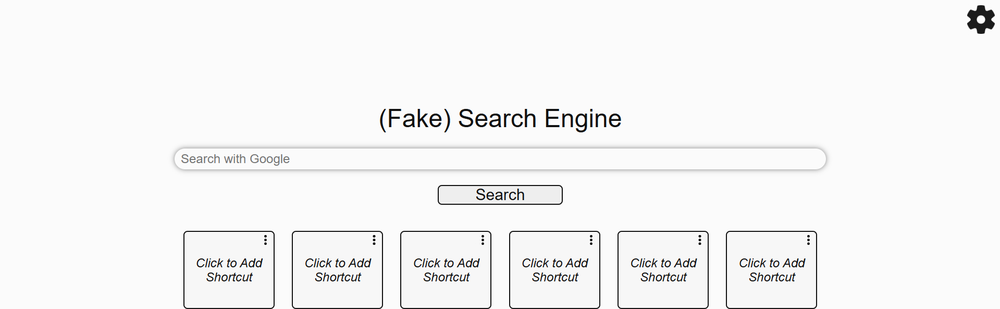
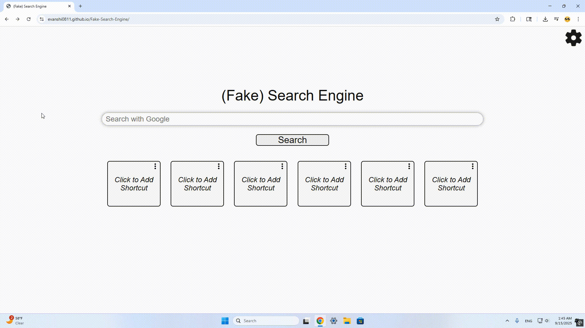
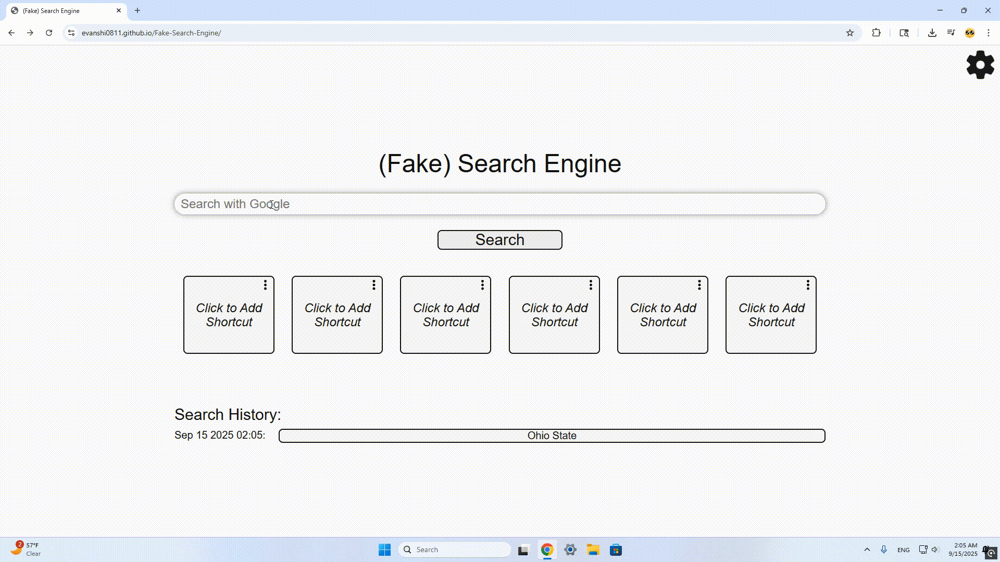
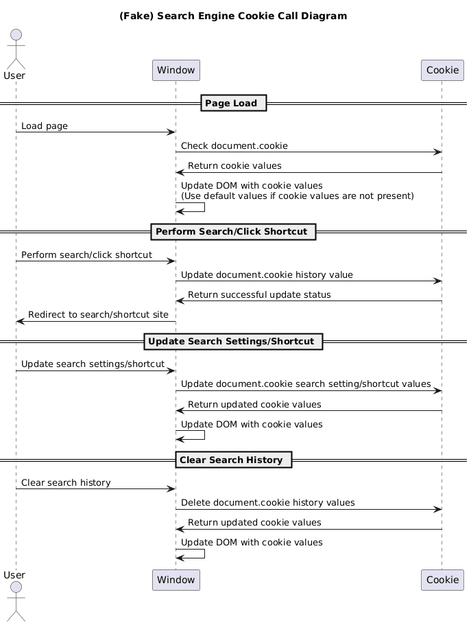
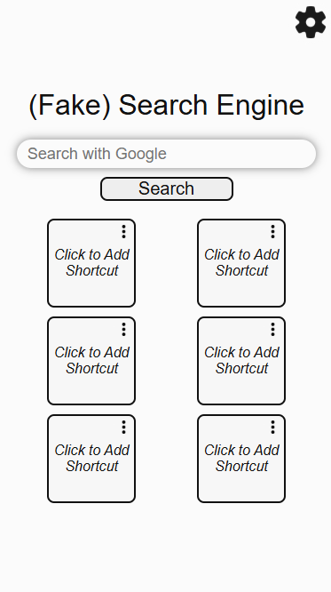
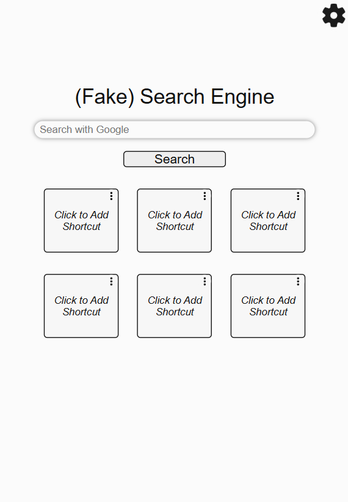
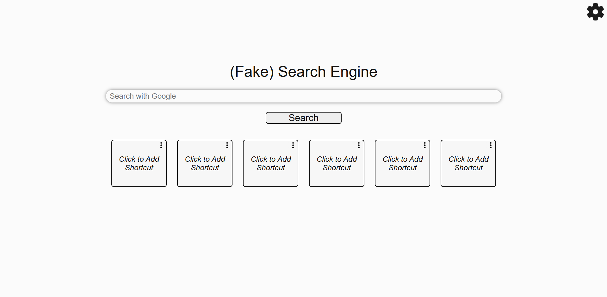

# (Fake) Search Engine

Welcome to (Fake) Search Engine, a simple website that allows anyone to endlessly and uniquely customize their search experience! If you've ever noticed other search engines getting bogged down with ads and other "features" that are ruining your search experience, this website is perfect for you! Not only does it have all of the features other search engines have with none of the distractions, but you also get to customize your search experience by picking which website you want to end up searching on!

Disclaimer: This website was created as a final project for SI 339.
## Table of Contents

- [Guide](#Guide)
- [Features](#Features)
- [Cookies](#Cookies)
- [FAQ](#FAQ)
## Guide

Using (Fake) Search Engine is very simple. Simply head to the website hosted at https://evanshi0811.github.io/Fake-Search-Engine/.

No additional downloads or setup required!
## Features

### Search

With (Fake) Search Engine, simply type whatever search option you would like to search into the search bar, and the website will redirect you to your intended search through your search engine of choice!

Search engine options include Google, Bing, Youtube, Yahoo, Yandex, DuckDuckGo, Baidu, and Ecosia!

The search engine used can be modified in settings.

#### Example

### Shortcuts

6 Shortcuts can be added to (Fake) Search Engine. Each shortcut can either be a URL or a seach query by itself.

Additionally, each shortcut can be modified by clicking the 3 dots on the top right of the shortcut.

#### Examples

### Search History

(Fake) Search Engine will also keep track of your last eight searches, as well as the date and time these searches took place.

You can clear the history in settings.

#### Example

## Cookies

Cookies are used to store the search engine preference, shortcuts, and search history information.

### Diagram

## FAQ

### Is the code for (Fake) Search Engine publicly available?
Yes, the code is available here: https://github.com/evanshi0811/Fake-Search-Engine

### Is any future development planned for (Fake) Search Engine?
No, there is not currently any future development planned.

### Will any of my search information be stored?
Search information will only be stored on your local browser…

### Will (Fake) Search Engine work on all web browsers?
Currently confirmed on Chrome and Safari…

### Does (Fake) Search Engine work on all devices?
(Fake) Search Engine is designed for all device sizes.

**Mobile:**  

**Tablet:**  

**Laptop/Desktop:**  

